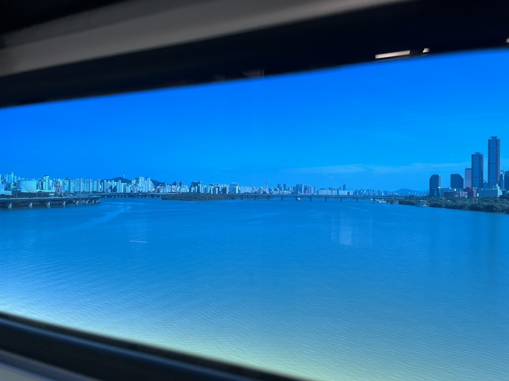
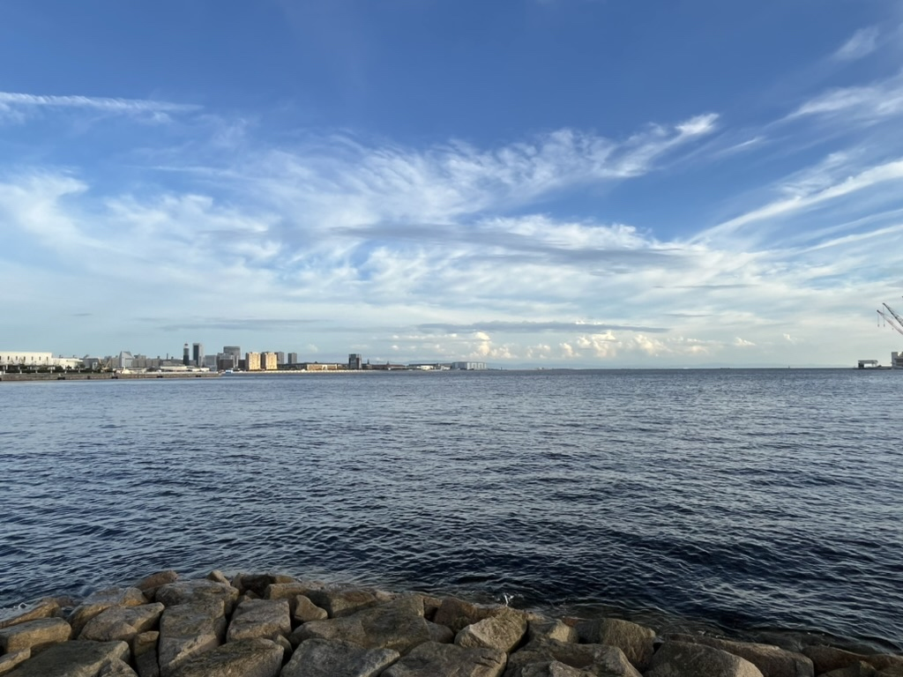

## 我在成为谁
随着逐渐长大，我发现很多之前听过的，当时不以为然的话正在一一变成现实，小时候老师说过“别看现在关系很好，很多人在毕业后再也见不到了”，那时候我和朋友一起踢球，一起学习，一起疯玩，心想以后肯定也会是一辈子的好朋友，对老师说的话不以为然，然后讽刺的是我们已经有五六年没有联系了，甚至连彼此的微信都没有加。包括父母以前说的那些话貌似也在验证，甚至我开始经常吃小时候很讨厌的水煮蛋，开始觉得那些只有大人才喜欢的食物，比如萝卜、豆腐也挺好吃的。我不禁在想，我究竟在成为谁？在过了25岁生日后的自己却过得越来越不像自己了，我也开始说着那些：“你以后就懂了”，“不都这样”的以前根本不放在眼里的话，人的一生就像是巨大的自证预言，接受着来自下一个时间点的人的话，又在自己到那个时间点之后去验证它，继续传述给下一辈。

刚工作的时候，我一心想着在大厂工作后要做个remote工作，和女朋友全球旅居生活，也在心里觉得那些年过三十，背着房贷承担失业压力的前辈过着很俗套的生活，然而在自己真的要面临选择时，我开始想如果继续在国内生活，医保社保怎么缴纳，现在公司的福利也不错，好像在大厂继续多待几年，买房也不是很遥远的事情，和其他同学朋友比自己的生活其实也蛮满足的。当思绪忽然拉回来后，我突然发现自己也在考虑那些自认为很俗的事情，这可一点也不酷啊。于是，自己又在追求自由和面对现实之间纠结焦虑，这又何尝不是社会中大多数青年人面对的问题呢？自己貌似怎么都跳脱不出社会的框，从一个框又跳到另一个框中。

这不是命题作文，我也不必要在此就给自己找出一个“解法”，有些问题得不到答案也未尝不可，况且就算有真知就一定会令人幡然醒悟吗？有时候自己想得太多，没必要把自己放在宏大的社会中，为每一个现象给出看似合理的解。一个人再伟大，也终究只是自己生命中的主角，而我想做的是增强自己的“生命力”，而不是像现在一样有一种“淡淡的死感”，我希望可以表达自己的情绪，满足自己的好奇心，捍卫自己所坚持的。

回顾过去，给自己留下深刻印象的往往是一次叛逆，一次偶遇，一次意外，也往往正是那些“非主流”的选择，改变了自己的人生轨迹。或许我正在变得不像自己，成为社会中的大多数，成为新闻媒体中匆匆带过的数字之一，但也继续富有生命力地迎接每一天吧！